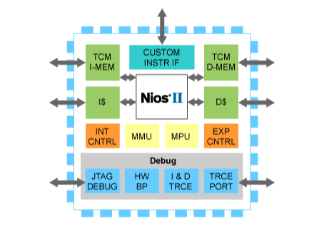
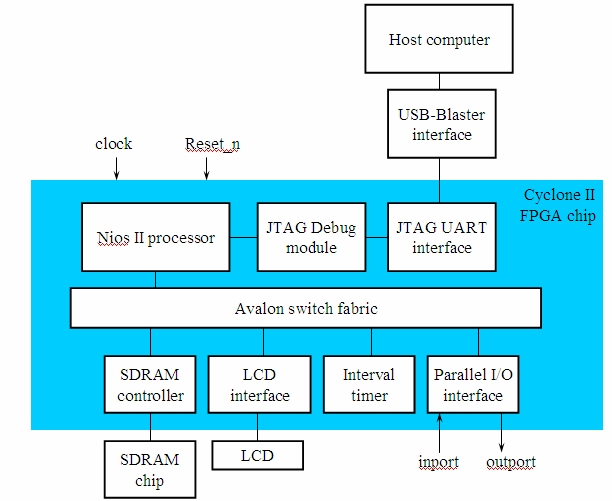
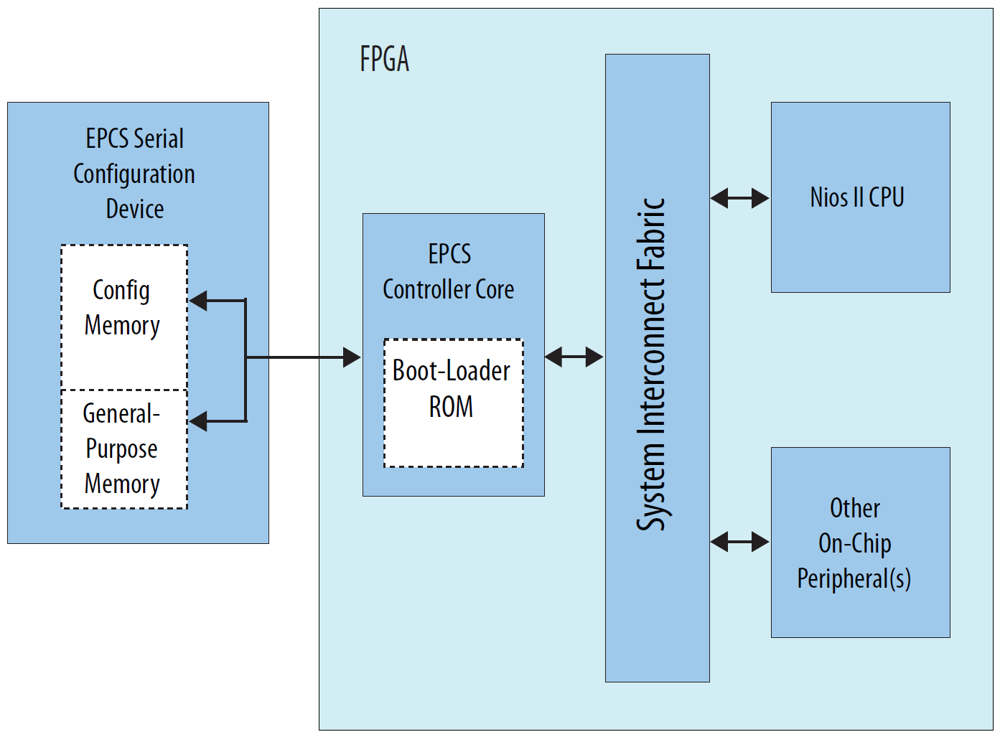

Tutoriales para el procesador NIOS II  
 
 

 
Información para bootear el NIOS II desde el EPCS4  
 
- Parche del Quartus 13.0 SP1: https://www.intel.com/content/www/us/en/programmable/support/support-resources/knowledge-base/solutions/rd11122013_865.html 
- Procedimiento para arrancar el NIOS II desde EPCS en Quartus 13.0 SP1: https://www.intel.com/content/dam/altera-www/global/en_US/kdb/rd11122013_865/nios-ii-boot-from-epcq-and-epcs-in-quartus-ii-13_0.pdf 
- Referente a bootloaders en EPCS: https://community.intel.com/t5/FPGA-Wiki/EPCS-bootloaders/ta-p/735918 
- Referente al NIOS Flash Programmer: https://www.intel.com/content/dam/www/programmable/us/en/pdfs/literature/ug/ug_nios2_flash_programmer.pdf 
- A workaround to get working the flash programming of a NIOSII on a EPCSx chip: https://www.programmersought.com/article/64594215641/
- Overview of the Nios II Flash Programmer: https://www.intel.co.jp/content/www/jp/ja/programmable/documentation/lro1429457708611.html 
<li>Esta página es la única que me sirvió parcialmente para grabar en la EPCS4 la configuración del NIOSII (sof) y el programa de usuario (elf)</li>
