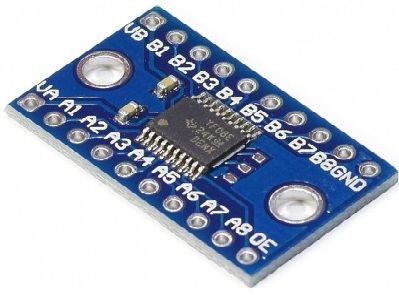

# Altera-Cyclone-II-FPGA
 
Repositorio de enlaces y proyectos hechos en el Quartus II para el FPGA Cyclone II  
 
Video informativo y tutorial de la tarjeta EP2C5T: https://www.youtube.com/watch?v=le6Jo5DpLao  
Enlace de referencia de información para la tarjeta EP2C5T: http://qqtrading.com.my/altera-cyclone-2-fpga-development-board-ep2c5t144 
Wiki para la tarjeta EP2C5: http://land-boards.com/blwiki/index.php?title=Cyclone_II_EP2C5_Mini_Dev_Board 
Wiki en español del procesador NIOS II: http://www.coffeebrain.org/wiki/index.php?title=Altera_SoftCore_NIOS_II 
Link de descarga del Altera Quartus II 13 sp1: http://fpgasoftware.intel.com/13.0sp1/ 
Case para la tarjeta EP2C5T:https://github.com/tocache/3D-Printing/blob/master/My%20STL%20files/Cyclone%20EP2CT5%20board%20case/  

 
Información acerca de las diferentes versiones de Quartus II y su soporte a los dispositivos, se puede apreciar que la última versión que da soporte a los Cyclone II es la 13.0 SP1:
 
<b>NOTA:</b> Tener en cuenta en seleccionar la familia de dispositivos Altera Cyclone II antes de descargar el paquete de instalación 
Conversor 5V a 3.3V bidireccional de 8 canales usando IC TI TXS0108E  
 

 
<b>Pasos para instalar el Quartus II v.13 sp1:</b> 
- Video paso a paso para la instalación (en inglés) https://www.youtube.com/watch?v=VOVD3epBY-s  
- Verificar que estén seleccionados los paquetes para los dispositivos Cyclone II: 
 
   

 
<b>Pasos para instalar el USB Blaster</b> 
- Una vez instalado el Altera Quartus II conectar el USB para proceder a la instalación manual del USB Blaster (sus drivers): 
 
 
 
 
 
 

 
Tener en consideración lo siguiente acerca del calentamiento en el regulador LM1117 1.2V y las resustencias de pullup internas: 
 

