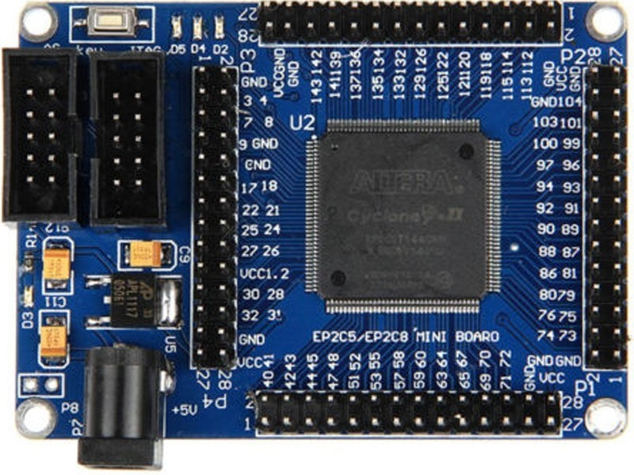

# VHDL-QuartusII
 
Repositorio de proyectos hechos en el Quartus II para el FPGA Cyclone II 

Wiki para la tarjeta EP2C5: http://land-boards.com/blwiki/index.php?title=Cyclone_II_EP2C5_Mini_Dev_Board 
 
Link de descarga del Altera Quartus II 13 sp1: http://fpgasoftware.intel.com/13.0sp1/ 
 
<b>NOTA:</b> Tener en cuenta en seleccionar la familia de dispositivos Altera Cyclone II antes de descargar el paquete de instalación 
Conversor 5V a 3.3V bidireccional de 8 canales usando IC TI TXS0108E  
 
Case para la tarjeta:https://github.com/tocache/3D-Printing/blob/master/My%20STL%20files/Cyclone%20EP2CT5%20board%20case/ 

**Pasos para instalar el Quartus II v.13 sp1:** 
- Verificar que estén seleccionados los paquetes para los dispositivos Cyclone II: 
 
 
- Una vez instalado conectar el USB para proceder a la instalación manual de sus drivers: 
 
 
 
 
 
 
